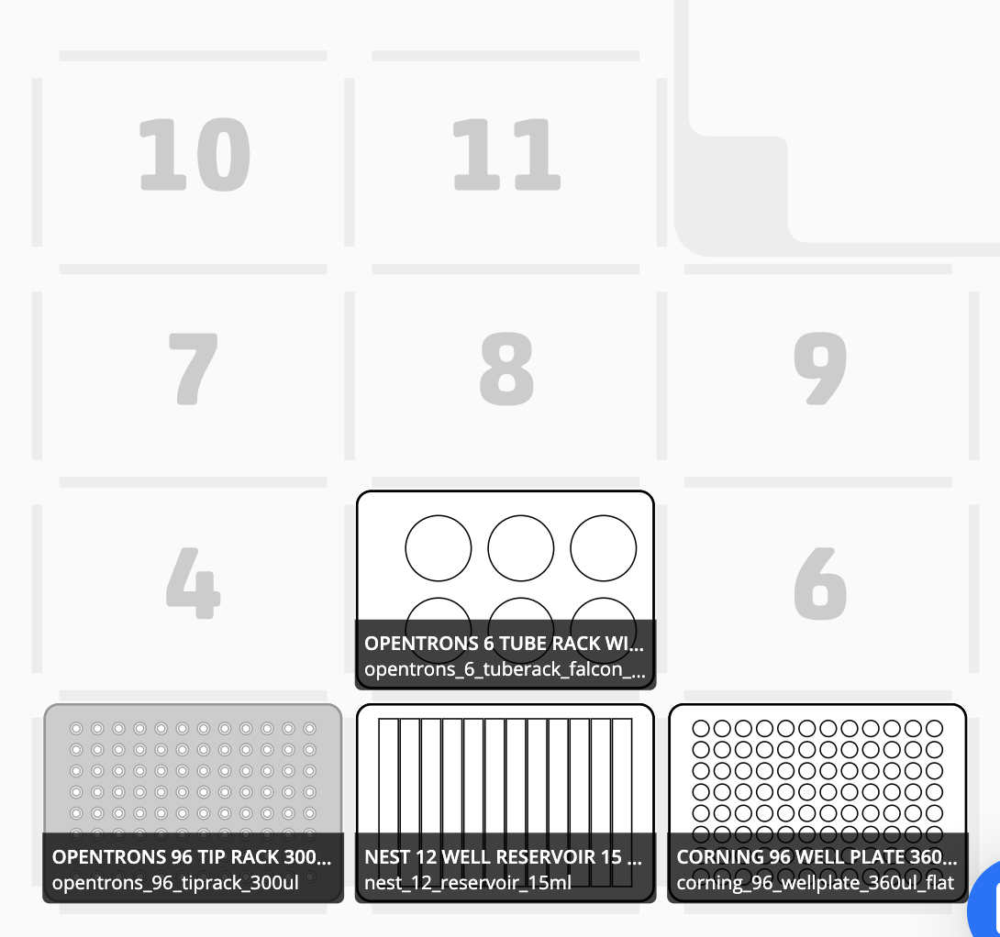
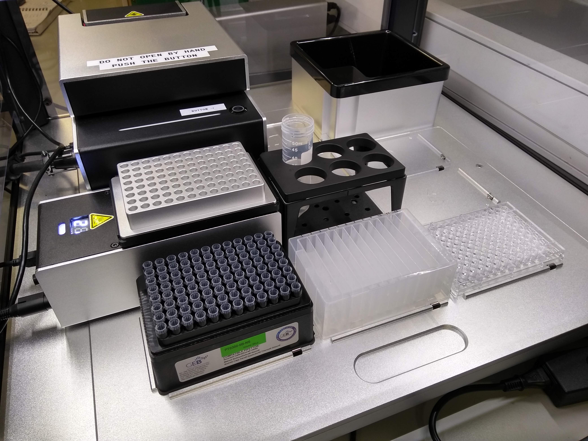

# Multichannel Pipette test by running a serial dilution

## Pipette setup:
Left: p300_single

Right: p300_multi_gen2


## testing the protocol
```
$ opentrons_simulate serial_dilution_w_multichannel.py
```

## Deck configuration




